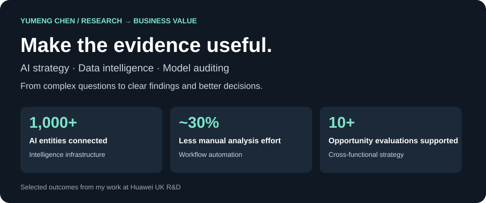
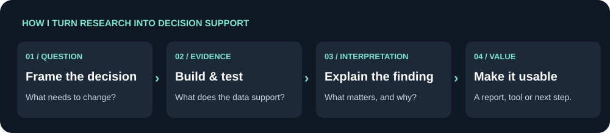

I believe rigorous analysis earns its value when someone can use it. I build intelligence systems, evaluate models and translate findings into clear choices.

**Previously: AI Strategy & Research Analyst, Huawei UK R&D**  
[LinkedIn](https://www.linkedin.com/in/yumeng-chen-5a7578214/) · [Kaggle](https://www.kaggle.com/yumengchen8097) · [Explore my analysis](https://github.com/chenymwork-eng/adult-income-gender-clustering)

## Research → insight → business value

### 01 / AI intelligence systems
**Professional work · Delivered**

| Research & build | Decision support | Delivered value |
| :--- | :--- | :--- |
| Connected 1,000+ AI entities in a five-layer Neo4j graph; built Power BI monitoring for 1,000+ companies. | Made research, company and market information easier to explore across teams. | Automated workflows reduced manual analysis effort by approximately **30%**. |
| Analysed frontier AI, investment trends and partnership opportunities. | Produced **5+ research reports** for senior R&D and strategy teams. | Supported **10+ strategic opportunity evaluations** with R&D, M&A, HR and Legal. |

**Python · Neo4j · Power BI · Competitive intelligence**  
Internal data and implementation remain confidential.

### 02 / Socio-economic analysis & latent cluster discovery
**48,842 records · Original figures from my final analysis report · [Explore all figures](https://github.com/chenymwork-eng/adult-income-gender-clustering)**

**Research finding:** the selected GMM solution reveals more differentiated female profiles than the two-group K-Means solution. PCA makes the model differences visible; it is an interpretive view, not proof of model superiority.

**From model output to insight:** income was excluded from training, yet the resulting profiles differ in income concentration. The report shows above-50K shares ranging from **1.7–61.8%** in male clusters and **2.1–38.7%** in female clusters. Cluster IDs are not comparable across the separately fitted models.

**Business relevance:** turn clusters into understandable profiles and testable questions for market research or service design. These are potential applications, not measured commercial outcomes or causal conclusions.

**Python · Clustering · Statistical analysis · Data reasoning**  
[Full visual case study: model selection, silhouette, cluster sizes, PCA, 3D and data context](https://github.com/chenymwork-eng/adult-income-gender-clustering)

### 03 / London Underground database system
**Completed project · Implementation materials not currently public**

| Operational question | What I built | Practical purpose |
| :--- | :--- | :--- |
| How can complex transport information become consistent and queryable? | A normalised relational schema, data-integrity controls and SQL reporting queries. | A structured foundation for operational reporting and reliable information retrieval. |

**My translation:** good data design makes the next business question easier to answer.

**SQL · Database design · Normalisation · Data integrity**

### 04 / AI model auditing & cross-cultural evaluation
**Research · Related paper accepted to ICMI 2026**

Research into how vision-language models behave and are evaluated across cultural contexts.

**Decision relevance:** understanding evaluation limits helps teams judge whether evidence is sufficient for a particular use case.

> More details will be shared after publication in **October 2026**.

### 05 / Reproducible LLM fine-tuning
**Independent project · In progress**

| Building | Evaluating | Intended decision |
| :--- | :--- | :--- |
| Instruction-data preparation and SFT workflows using Transformers, PEFT, LoRA and QLoRA. | Base-versus-adapted model performance, robustness and error patterns. | Whether adaptation offers a useful improvement for a defined task. |

**Hugging Face · LoRA / QLoRA · Model evaluation**  
Results are not yet final.

### 06 / Amytis — Research into interaction design
**Group K · Final prototype · End-to-end contributor**

Contributed to user interviews, analysis, personas, interaction design, prototyping and evaluation. The team's **12 survey responses and 5 interviews** informed a **Now / Next / Context** workspace designed to help researchers resume work after interruptions.

**Research → product value:** translate context-loss and distraction findings into Resume, Focus Mode and visible activity trails, then refine the design through evaluation. AI summaries remain conceptual; reduced cognitive load is an intended benefit, not a measured outcome.

[Explore the Amytis case study](https://github.com/chenymwork-eng/ISD-Reseach-App-for-neurodivergent)

### 07 / Risk & decision analysis
**Completed analytical case studies**

Used Python and pyAgrum for Bayesian reasoning, compared classification thresholds, examined confounding and expected utility, and analysed why technically strong AI models can fail to gain adoption.

**Research → business value:** connect model behaviour with error costs, uncertainty, interpretability and the decisions users actually need to make.

[Explore the decision-analysis case study](projects/risk-and-decision-analysis.md)

<strong>Other projects</strong>

- **Trustworthy Physiological Computing:** ongoing exploratory research on stress and cognitive-affective cost estimation; details remain private.

## Tools I use to make the work useful

| Analyse & reason | Build & evaluate | Communicate & support decisions |
| :--- | :--- | :--- |
| Python · SQL · Pandas · NumPy | PyTorch · Transformers · PEFT | Power BI · Tableau · Neo4j |
| Statistics · Segmentation · Data reasoning | Qwen · LLaVA · CLIP · LoRA / QLoRA | Research reports in English & Chinese |
| Evidence quality · Interpretation | Model auditing · Error analysis | AI strategy · Competitive intelligence |

**Interested in opportunities at the intersection of AI strategy, analytics and evidence-based research.**
